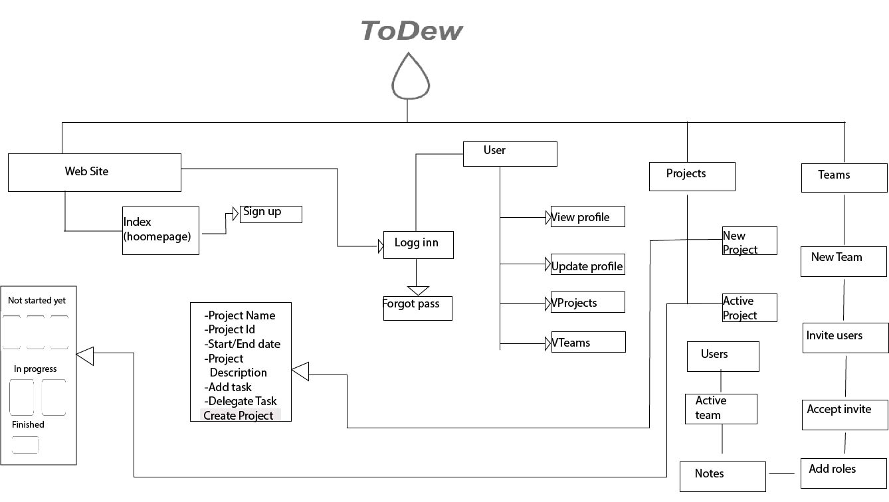
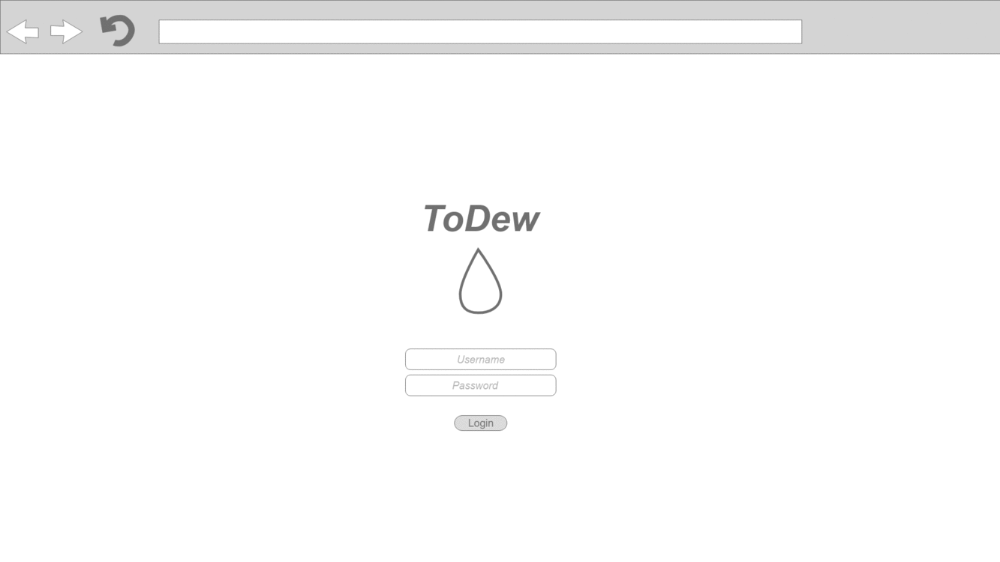
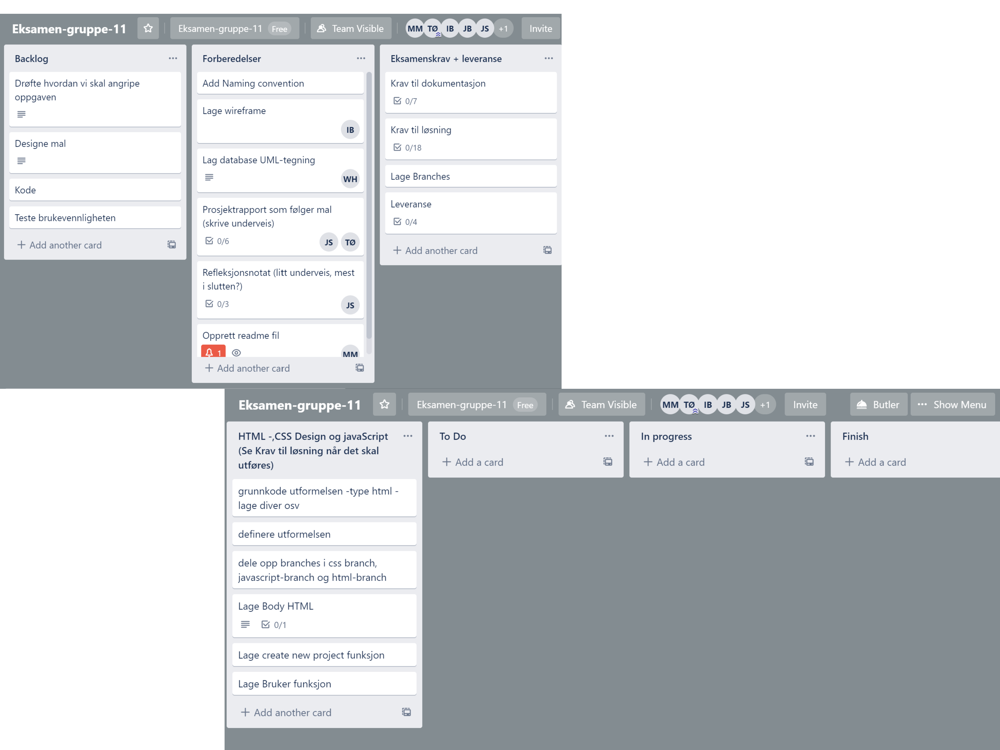
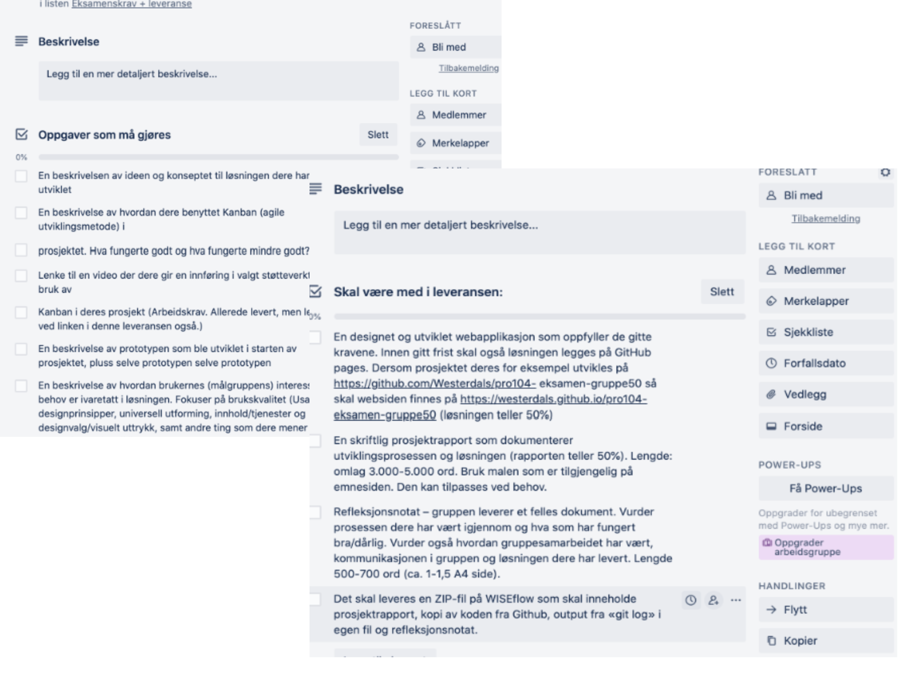

## Group 11 
Pro104 WebProject Exam

# ToDew
// Her skal vi ha bilde/giff av nettsida

## Table of contents
1. [About. ](#about)

2. [Concept. ](#concept)

3. [Development methodologies. ](#development)

4. [Prototype. ](#prototype)

5. [Logo. ](#logo)

6. [Class Description. ](#class)

7. [Requirements. ](#requirements)

8. [Installation. ](#install)

9. [Usage. ](#usage)

10. [Mobile support. ](#mobile)

11. [Technology/Framework used. ](#technology) 

11. [Code Style. ](#code)

## About

* Date: 13.05.2020-27.05.2020
* This is an Exam Assignment and we were 6 people collaborating on this Exam. 
* Responsive web app that helps the users with managing projects.
* Easy-to-use web app with a comprehensive overview, that is also compatible with mobile devices.
* Based on Usability, because we strove to deliver an app that our users will find it effective,efficient and satisfied.
* Our goal is to meet the users expectations and needs,as quickly and dependably as possible. 
* Our target group is students or people who works on project, but are not familiar with using such auxiliary tools.
* The app have the ability to keep track of deadlines,collaborative/individual overview, as well as to set an reminder.
* The app have the ability to see available resources aka team members without assigned tasks, list of who has performed the various tasks,
  so it should be easy to go back and know who has worked on what. 
* The possibility to easy change the owner of the tasks/allocate the tasks/switch tasks and leave tasks.
* The program follows a clean line when it comes to design,so that tasks are in focus. 
* User-friendly.
* Visual aid, neat and intuitive to use.  
<ins> This web app includes the following pages and corresponding functionality: </ins>

## Concept

We created a wireframe,that includes where our components in the responsive app will find a place, and then drawn the sketch.
The concept sketch, was one of our initial steps in our brainstorming process of creating this app.
The reason behind creating a concept sketch,was because we wanted to visualize the project together from the start,
which helped our team to shape/share our ideas, and to get a clear idea of what kind of design we will go for. 
Because of that, we created a quick and simple way to clarify our ideas and keep the project moving forward.  
 
 

## Development methodologies

* Use of a Kanban Board  
The purpose of Kanban is to create continuous change and improvements.Kanban is used to discuss
process and make suggestions for improvements.
By using the Kanban Board, we have made a preparation for the upcoming work during this project. 
Since this is a digital group project, and we were not able to meet in person due to COVID-19, we found
that the best way to create a Kanban Board will be using an online tool. Because of that, we choose
to use Trello, which is a collaboration tool that organizes projects into boards.
By using the Kanban Board, we did have an overview on what's we have been working on,who's working on what,
and the work process/progress. Once we were done with the given task, we gave the status to the task as "completed", and 
all of the tasks have been assigned their own deadline.

## Prototype

* An interactive mockup of our web design.
* High-fidelity visual version of the app,that allows you to link between pages. 
* [Prototype](https://xd.adobe.com/view/d473a8d5-681e-4022-612c-0780508b4732-a242/?fullscreen) shows how the plan was that our app would work/look like before we build it up.
 
 

## Logo

## Class Description

## Requirements

* Online browser
* Mobile device / Laptop / Desktop
* 

## Installation
First of all, you have to have access to Github.To compile/run this project, first you need to clone/download it from Github.
You can either <ins>*clone* </ins> this repo to your local machine using [Github](https://github.com/Westerdals/pro104-eksamen-gruppe-11)   and clone it into a folder;
or you can <ins>*download* </ins> the whole project as a zip file and then unpack the file.
There is also possibility to use SSH instead of https. 
The steps for cloning the project by use of SHH are to open the Intellij and select **"Check out from Version Control**, select **GIT**.
Once **Git** is selected, paste the Git repository URL, and select the directory where you want to clone it into.
You will be asked if you want to connect to Github, and you should click yes.
Now, intelliJ will tell you that there is an Unlinked project,so click on import Gradle project;use the auto-import and unselect the "create Separate module per source set"-then ok.
The next step is to right-click the project,and open Module settings,select SDK's, and there you have to select the JDK that is installed on your system and click ok; and the project is installed and ready to run.
You are also able to use WebStorm. You have to specify the URL of the project [Github](https://github.com/Westerdals/pro104-eksamen-gruppe-11)  , enter the path to the folder where your
local Git repository will be created,and click Clone.WebStorm will automatically set Git root mapping to the project root directory.
As well as you are also able to use Brackets, or any other source code editor that you are familiar with.

## Usage

Our vision is to create an application that will be easy to use, and helpful tool for managing projects, 
in other words app-for collaborating smoothly.
The users will have the ability to create a project and add a tasks to it, create a team,assign tasks,shows
who is working on what,set deadlines and give reminders.
Our responsive app is effective and easy to use, and responds to the user's preferences.
To be able to use our app you have to have an online browser(whether on your desktop or mobile device), and ....

// mer tekst kommer her nå vi er i box med koding.

## Mobile support

* Mobile friendly.  
* Use of "Viewport Meta Tag".  
As the user switches from their Desktop to their mobile device, the app would automatically 
switch to accommodate for resolution, image size and scripting abilities.
* Changes the way it's displayed and arranged based on the size of the device screen.
* Includes absolutely the same content, functions and information.

## Technology/Framework used

We have been using different technologies/frameworks to create this app, in order for the app to work smoothly and look nice. 
* Naming convention before we start coding.
* Post-it cards design with clickable links.
* +++

| JavaScript  | HTML | CSS | GIT | 
| ------------- | ------------- | ------------- |------------- |
| skrive kode først| skrive kode først |  :root  |   |
| skrive kode først |skrive kode først  | skrive kode først | |

## Code style

* Standard
* camelCase
* Long words are separated by underline(_)
* Use of abbreviations
* No trailing white space
* Comments above the start tag of the elements(briefly and concisely in English)
* New line for each declaration
* Names are short and descriptive

