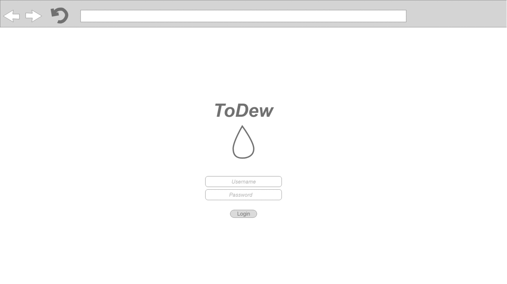
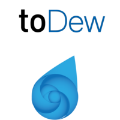
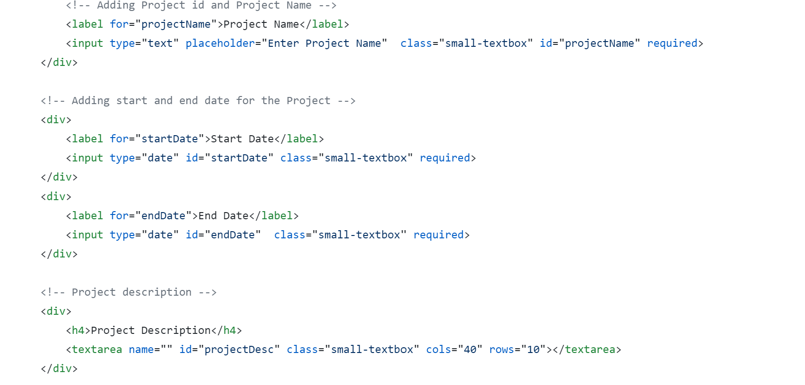
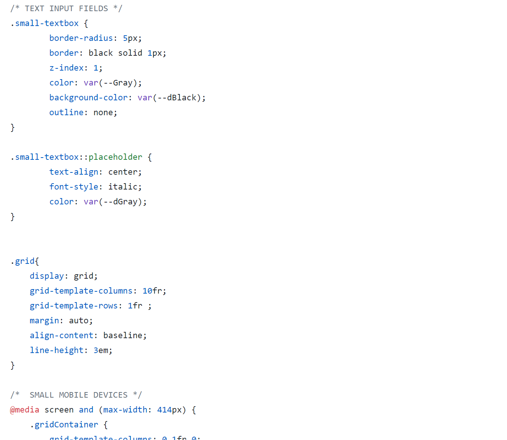
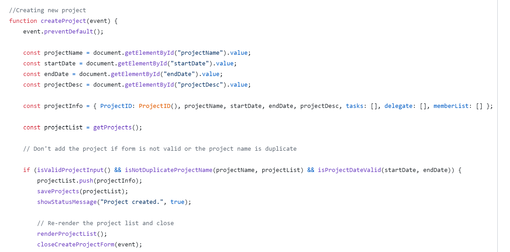

 ## Group 11 ! 
 Pro104 WebProject Exam 

# ToDew
// Her skal vi ha bilde/giff av nettsida

## Table of contents

1. [Prerequisites. ](#prerequisites)

2. [About. ](#about)

3. [Concept. ](#concept)

4. [Development methodologies. ](#development)

5. [Prototype. ](#prototype)

6. [Logo. ](#logo)

7. [Class Description. ](#class)

8. [Requirements. ](#requirements)

9. [Installation. ](#install)

10. [Usage. ](#usage)

11. [Mobile support. ](#mobile)

12. [Technology used. ](#technology) 

13. [Code Style. ](#code)

## Prerequisites

**Before you continue, ensure you have meet the following requirements:**
* You have installed an browser for display like Firefox, Google Chrome, Opera, Safari etc.
* Text editor
* NodeJS

## About

* Date: 13.05.2020-27.05.2020
* This is an Exam Assignment and we were 6 people collaborating on this Exam. 
* Responsive web app that helps the users with managing projects.
* Easy-to-use web app with a comprehensive overview, that is also compatible with mobile devices.
* Based on Usability, because we strove to deliver an app that our users will find it effective,efficient and satisfied.
* Our goal is to meet the users expectations and needs,as quickly and dependably as possible. 
* Our target group is students or people who works on project, but are not familiar with using such auxiliary tools.
* The app have the ability to keep track of deadlines,collaborative/individual overview, as well as to set an reminder.
* The app have the ability to see available resources aka team members without assigned tasks, list of who has performed the various tasks,
  so it should be easy to go back and know who has worked on what. 
* The possibility to easy change the owner of the tasks/allocate the tasks/switch tasks and leave tasks.
* The program follows a clean line when it comes to design,so that tasks are in focus. 
* The app includes intuitive color choices for importance-red,green and yellow.
* Calendar layout.
* Use of drag and drop.
* Saving information in Local Storage.
* User-friendly.
* Visual aid, neat and intuitive to use.  

## Concept

We created a wireframe,that includes where our components in the responsive app will find a place, and then drawn the sketch.
The concept sketch, was one of our initial steps in our brainstorming process of creating this app.
The reason behind creating a concept sketch,was because we wanted to visualize the project together from the start,
which helped our team to shape/share our ideas, and to get a clear idea of what kind of design we will go for. 
Because of that, we created a quick and simple way to clarify our ideas and keep the project moving forward. 
We have weighed in, both for and against the various solutions and come to the conclusion that a Kanban-concept where post it- cards.
are color-coded by priority and are able to be moved according to how they fit into the project, is something we would like to go for!  

 

## Development methodologies

 We have been using the Kanban Board. 
 The purpose of Kanban is to create continuous change and improvements.Kanban is used to discuss
 process and make suggestions for improvements, and Kanban Board gives the opportunity to be prepared for the upcoming work during the project. 
 Our inspiration comes from using Trello for this project, which is a collaboration tool that organizes projects into boards.
 By using the Kanban Board, we had an overview on what's we have been working on,who's working on what,
 and the work process/progress. Once we were done with the given task, we gave the status to the task as "completed", and 
 all of the tasks have been assigned their own deadline.Considering that Kanban Board is an agile project managment tool,which helps to visualize
 work, limit work-in-progress, and maximize efficiency,we chose to include Kanban Board in our responsive app,in order to give it a
 better structure and overview of the different parts of the project. "toDew" uses post-it cards. 

## Prototype

* Adobe XD used.
* An interactive mockup of our web design.
* High-fidelity visual version of the app,that allows you to link between pages. 
* [Prototype](https://xd.adobe.com/view/d473a8d5-681e-4022-612c-0780508b4732-a242/?fullscreen) shows how the plan was that our app would work/look like before we even build it up.
 
 

## Logo
- We wanted to include an recognizable graphic design element, that will identify our own website, and hopefully increase our own app recognition.
  Considering that the overall design of the website itself is very simple, clean and user-friendly, we focused on creating a logo that will be simple,
  easy to recognize, as well as our logo to be associated with toDew (the product/responsive app) it represents.
  While designing the logo, we started with the name of the app itself, and created the logo based on it.
  The name of the app itself, came from "toDo", which basically means that it contains all of the tasks that need to be completed, as well as to accomplish,overview and
  plan the project. Considering that the pronunciation of "toDo" and "toDew" is very similar, we gave the name to our app to be "toDew", which symbolizes both
  purity(simple design), freshness(recently made) or power to refresh(reminder), and toDo list.
  We have decided to go for "Combination Mark" logo, by including the Water-drop symbol, and the name of the app. The "Water Drop"
  has an intertwined design where two shapes are combined together in one water drop, which again gives association of something in common and easy merging
  in order to achieve a common goal-team collaboration. The color that we used for our logo is mostly "Blue", which is often associated with harmony,trust and stability.Considering that, 
  we strove to deliver an app that will have an visual harmony, will be stable and easy to use. In other words, 
  we wanted our logo to give impression of "toDew", as a helpful tool and a tool that our users can rely on.   
 
  

 **Adobe Illustrator is used for designing the logo** 
  

## Class Description
**<ins>Index class</ins>** is "toDew's" Home Page, and is the main page of the website. It is the class for
the page that is first shown up in a web browser, when the application starts up. It includes "toDew's" logo,
and intro to the different options that the application has to offer. 
The main function is to navigate the user to the other pages. 

**<ins>Project Page</ins>** is where the project manager is placed. This class has the main function. The functions that are included in Project Page, are
the ability for user to manage tasks,set priority level to tasks, delegate tasks to members, as well as to add new project. Once the task is 
created, the user have the ability to create a post it card, and place the card either on todo, work-in-progress, or finished.
Once the task is created, the class have the function to place the task automatically in "todo" section of the page. 
From there the users are able to take the tasks to the different stages- todo, in-progress and finished.
This class, has as well the function to show the status- who is working on what. 
In project Manager, you can also choose to create a team, by adding team names,members and roles. 

**<ins>Project Register</ins>** class, have the functions for creating new project, including project name, start/end date, and priority level.
All of the projects that have been entered in, are then printed in boxes on the page. And you can easily click on 
Project name(box), and switch to the Project Manager page in order to be easily able to manage the projects.  

**<ins>Task Register</ins>** is the popUp, and the functions in this class allows you to create tasks for chosen project, and to delegate members to different tasks.  

**<ins>User Register</ins>** consists of functions for creating a New user. You can choose user Name, and you have to enter First and Last name. 
This class have the function to print out the registered members.  
 
**Each class have its own JS, HTML and CSS code.**

## Requirements

* Online browser
* Mobile device / Laptop / Desktop

## Installation
First of all, you have to have access to Github.To compile/run this project, first you need to clone/download it from Github.
You can either <ins>*clone* </ins> this repo to your local machine using [Github](https://github.com/Westerdals/pro104-eksamen-gruppe-11)   and clone it into a folder;
or you can <ins>*download* </ins> the whole project as a zip file and then unpack the file.
There is also possibility to use SSH instead of https. 
The steps for cloning the project by use of SHH are to open the Intellij and select **"Check out from Version Control**, select **GIT**.
Once **Git** is selected, paste the Git repository URL, and select the directory where you want to clone it into.
You will be asked if you want to connect to Github, and you should click yes.
Now, intelliJ will tell you that there is an Unlinked project,so click on import Gradle project;use the auto-import and unselect the "create Separate module per source set"-then ok.
The next step is to right-click the project,and open Module settings,select SDK's, and there you have to select the JDK that is installed on your system and click ok; and the project is installed and ready to run.
You are also able to use WebStorm. You have to specify the URL of the project [Github](https://github.com/Westerdals/pro104-eksamen-gruppe-11)  , enter the path to the folder where your
local Git repository will be created,and click Clone.WebStorm will automatically set Git root mapping to the project root directory.
As well as you are also able to use Brackets, or any other source code editor that you are familiar with.

## Usage

Our vision is to create an application that will be easy to use, and helpful tool for managing projects, 
in other words app-for collaborating smoothly.
Our responsive app is effective and easy to use, and responds to the user's preferences.
To be able to use our app you have to have an online browser(whether on your desktop or mobile device). 
The users will have the ability to create a project and add a tasks to it, create a team,assign tasks,shows
who is working on what,set deadlines and give reminders.
To be able to create a project, you need to specify the name of the project. Then you will be asked to add Start and End date, and project description.
Once the project is created, you have the opportunity to click on the project that have been created, and you will be directly moved to Project manager page.
(as well, as you have the opportunity to go to project-manager page by use of the navbar).
In there you can create a tasks with start/end date and priority level. You can also create you own team, by click on teams once you are in Project Manager page,
you can add members to your team, add roles and tasks as well. Once the tasks are created you have also the ability to move them through the different stages.
During the project you have ability to change the status on tasks from not started, to work-in-progress og finished. As well as you have ability
to see which member is working on what. 
Once,you go to profile, you be able to see user information, as well as user's active projects. 

## Mobile support

* Mobile friendly.  
* Use of "Viewport Meta Tag".  
As the user switches from their Desktop to their mobile device, the app would automatically 
switch to accommodate for resolution, image size and scripting abilities.
* Changes the way it's displayed and arranged based on the size of the device screen.
* Includes absolutely the same content, functions and information.

## Technology used 

We have been using different technologies to create this app, in order for the app to work smoothly and look nice. 
* Drag and Drop in order to make the user experience simple.
* Storing and retrieving information in local storage
* Scaling by use of Grid.
* 

| JavaScript  | HTML | CSS | GIT | 
| ------------- | ------------- | ------------- |------------- |
| Curly-bracket syntax|  |  :root  |   |
| Prototype based object-orientation. | | Grid | |
| VanillaJS |  | Flexbox | |
| NodeJS|  | | |

## Code style

* Standard
* File names are written with camelCase.
* The name is short and descriptive of the contents of the file.
* JavaScript files are stored with ".js", in scripts folder.
* HTML files are stored with ".html".
* CSS files are stored with ".css", in css folder.

**HTML** 
* When naming elements in form of id and class, camelCase is always used.
* If names becomes too long, words can be separated by an underline(_).
* Only known abbreviations are allowed.
* Shortening already short words is avoided.
* Comments above the start tag of the elements(briefly and concisely in English.), with <!-- -->.
* A "
" element with a lot of content collapses when not working with it.
* In one element, included attributes are added in standard order, other additional attributes are added in alphabetical order.
* Code blocks that are child elements are always created at three spaces (or a tab) corresponding to their parent element.

**CSS**
* Since elements referenced in HTML use camelCase, the selector in CSS is also used with camelCase.
* Comments are written briefly and concisely in English using "/ * * /", and above the start tag of the elements.
* Elements, use spaces before the opening bracket and place it on the first line. The end bracket places a new line after the content.
* New line for each declaration.
* "property" and "value" are written on the same line and end with a semicolon.

**JavaScript**
* Camelcase is used when naming all statements.
* Shortening already short words is avoided.
* Only known abbreviations are allowed.
* Functions,conditions and loops always use spaces between operators. Use spaces before the opening bracket and place it on the first line.
  The end bracket places a new line after the content.
* Statements ends with a semicolon.
* Comments are written briefly and concisely in English using "//".
* Comments are used above the start tag of the elements.

